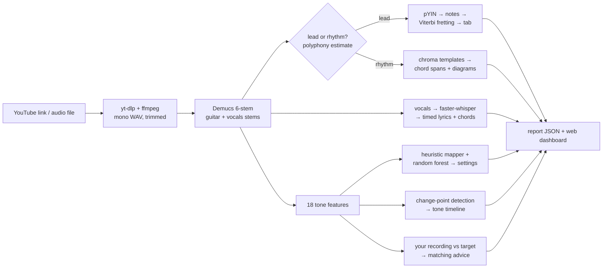

# FretScope

**Paste a song. Get the guitar back out of it — what was played, and how it was made to sound.**

FretScope takes a YouTube link or audio file, isolates the guitar with source
separation, transcribes what's being played, estimates the effect chain that shaped
the tone, and then closes the loop: record yourself through your own rig and it
tells you what to turn to get closer. Everything runs locally on CPU — no cloud,
no GPU, no API keys.

## What you get per song

| Output | How |
|---|---|
| **Isolated guitar stem** (playable in-browser) | Demucs `htdemucs_6s` dedicated guitar stem, with an energy-share fallback when the model misfiles the part |
| **Tab** (lead parts) | pYIN pitch tracking + onset segmentation → Viterbi fret assignment over a hand-movement cost model |
| **Chord sheet** (rhythm parts) | Chroma template matching (triads + 7ths) with decay hysteresis → SVG chord diagrams, a playback-synced chord ribbon, and chords aligned to Whisper-transcribed **lyrics** |
| **Tone breakdown** | 18 audio features → effect categories (drive, compression, chorus, delay, reverb) + a random-forest model that predicts concrete settings (drive dB, reverb wet, delay ms...) with its own held-out error attached |
| **Tone timeline** | Windowed features + change-point detection → per-section tone analysis ("clean verse, driven chorus") |
| **Tone matching** | Record/upload your attempt → feature deltas vs the target → directional advice ("add drive slightly, shorten the reverb tail") |
| **Song facts** | Key (Krumhansl-Schmuckler), tempo, tuning offset in cents |

## Architecture



The dashboard is a FastAPI server with a vanilla-JS front end (no build step),
a thread-based job queue with on-disk state, and a charcoal UI where the section
nav is a rendered electric guitar and effect estimates are drawn as stompboxes.

## The interesting engineering bits

- **Closed-loop tone matching sidesteps an unsolvable problem.** Identifying gear
  from a recording is not reliably possible; *comparing two recordings* is easy and
  useful. FretScope measures the same features on the song and on your attempt and
  emits signed deltas as plain-English adjustments.
- **The tone model is trained on data we synthesize ourselves.** ~1400 clips of
  Karplus-Strong guitar (palm-muted to ringing, dark to bright) rendered through
  pedalboard effect chains with *known* settings; a random forest inverts features
  back to parameters. Every prediction ships with the model's held-out MAE, and the
  training-domain gap (synthetic chains, not real amps) is disclosed in the UI.
- **Chorus detection is model-only, and the failed attempts are documented.** Three
  hand-crafted detectors (spectral-centroid wobble, per-bin envelope modulation,
  cepstral delay tracking) could not separate chorus from note-rate structure; the
  forest can, using two sub-band modulation features jointly with the rest. The
  chain's chorus card exists only when the model is confident.
- **Rhythm is an adversary.** Played notes pulse the envelope at the note rate, so
  naive detectors hear every riff as tremolo and every repeated phrase as delay.
  The modulation/echo detectors mask the onset rate and its harmonics (cost:
  tempo-synced delay is invisible — documented). Similarly, a 7th chord must beat
  its own base triad by a margin, because the third's 3rd harmonic *is* the major
  7th, and every triad would otherwise relabel itself.
- **Honesty is enforced, not aspirational.** Every report section carries a
  confidence label (`verified` / `heuristic` / `estimated`); tone output is never
  phrased as gear identification (a test fails if it is); known failure modes
  (reverb vs distortion sustain, separation artifacts in matching) degrade to
  labeled uncertainty instead of confident noise.

## Quickstart (Windows shown; Linux/macOS equivalent)

```powershell
python -m venv .venv                      # Python 3.12 recommended
.venv\Scripts\pip install -e .[dev]
# heavy optional extras:
.venv\Scripts\pip install -e .[separation]   # Demucs + torch (CPU is fine)
.venv\Scripts\pip install -e .[lyrics]       # faster-whisper

.venv\Scripts\fretscope serve             # open http://127.0.0.1:8321
# or headless:
.venv\Scripts\fretscope analyze "https://www.youtube.com/watch?v=..." --out jobs/
```

`ffmpeg` must be installed (`winget install Gyan.FFmpeg` / `apt install ffmpeg`).
Everything except separation/lyrics works without the heavy extras — the pipeline
degrades gracefully and says so in the report.

Tests: `pytest` (56 tests, all on synthesized audio — no copyrighted recordings in
the repo, no network calls).

Retrain the tone model: `python -m fretscope.tone.train` (~30 min CPU).

## Honest limitations

- Two guitars playing at once (lead + rhythm) cannot be separated — by anything,
  including commercial tools. Every report says so.
- Tab is *one playable interpretation*, chosen by a cost model. Bends, slides and
  vibrato are not detected.
- Tone settings are starting points inferred from audio features, not measurements
  of the original rig.
- Sung-lyric recognition mishears; lines are labeled heuristic.

See `CLAUDE.md` for the full decision log and `docs/SOP.md` for the working
conventions (confidence labels, commit style, plain-English-first rule).
